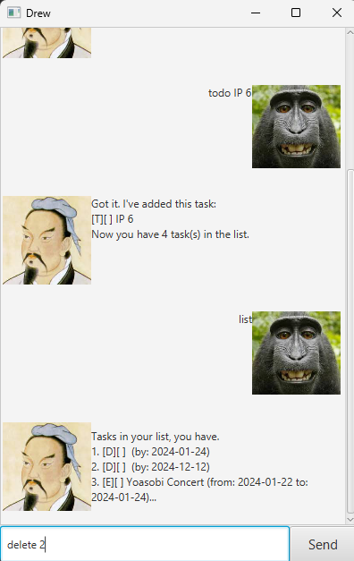

# Drew User Guide



# Drew, **_The_** chat-bot of all time.
> "He who does not remember his tasks, will not do them." - Sun Tzu

Do you want to be:
- [ ] Productive
- [ ] Up to date
- [ ] Great

If you answered **YES** to all the above, then Drew is **_The_** buddy for you!

All you need to do to achieve greatness is:
1. Download the code from [here](https://github.com/cocoanautz/ip).
2. Run the jar file with `java -jar drew.jar` _Java 11 required_
3. Key in your tasks.

Features include:
- Cool pal to talk to 😎
- No nonsense. Only do what you need to do. 💯

Look at how cool this response in the `executeCommand` method is:
``` java
int firstBackslashIndex = input.indexOf("/by");
if (firstBackslashIndex == -1) {
    throw new IllegalArgumentException("Incorrect input. Ensure that date begins with /by");
}
```

## Adding todos

Todos are tasks that only have a description.
This command adds a new todo to your list.

Syntax: `todo [desciption]`

Example: `todo homework`

Expected output:
```
Got it. I've added this task:
[T][] todo
Now you have [some number] tasks(s) in the list.
```

## Adding deadlines

Deadlines are tasks that have a due date. 
This command adds a new deadline to your list.

Syntax: `deadline [desciption] /by [YYYY-MM-DD]`

Example: `deadline homework /by 2024-01-01`

Expected output:
```
Got it. I've added this task:
[D][] homework (by: 2024-01-01)
Now you have [some number] tasks(s) in the list.
```

## Adding events

Events are tasks that have a start and end date.
This command adds a new event to your list.

Syntax: `event [desciption] /from [YYYY-MM-DD] /to [YYYY-MM-DD]`

Example: `event concert /from 2024-01-01 /to 2024-01-03`

Expected output:
```
Got it. I've added this task:
[E][] concert (from: 2024-01-01 to: 2024-01-03)
Now you have [some number] tasks(s) in the list.
```

## Deleting tasks

This command deletes a task your list.

Syntax: `delete [task index]`

Example: `delete 1`

Expected output:
```
Ok. I have deleted this task :
[E][] concert (from: 2024-01-01 to: 2024-01-03)
Now you have [some number] tasks(s) in the list.
```

## Mark tasks as completed

This command marks a task as done in your list.

Syntax: `mark [task index]`

Example: `mark 1`

Expected output:
```
Well done! I have marked this task as done:
[E][X] concert (from: 2024-01-01 to: 2024-01-03)
```

## Unmark tasks

This command unmarks a task in your list.

Syntax: `unmark [task index]`

Example: `unmark 1`

Expected output:
```
Ok. I have marked this task as not done yet:
[E][] concert (from: 2024-01-01 to: 2024-01-03)
```

## List all tasks

Lists all the tasks in your list.

Syntax: `list`

Expected output:
```
Tasks in your list, you have.
1. [E][] concert (from: 2024-01-01 to: 2024-01-03)
1 task(s) in the list, there are.
```

## Find task

Finds a task description that matches the given string.

Syntax: `find [string]`

Example: `find concert`

Expected output:
```
Here are the matching tasks in your list:
1. [E][] concert (from: 2024-01-01 to: 2024-01-03)
```

## Save tasks

Saves the list into a text file.

Syntax: `bye`

Expected output:
```
Bye. Hope to see you again soon!
```
Note: Please use the command **before** exiting. Closing the window will **not** trigger a save.